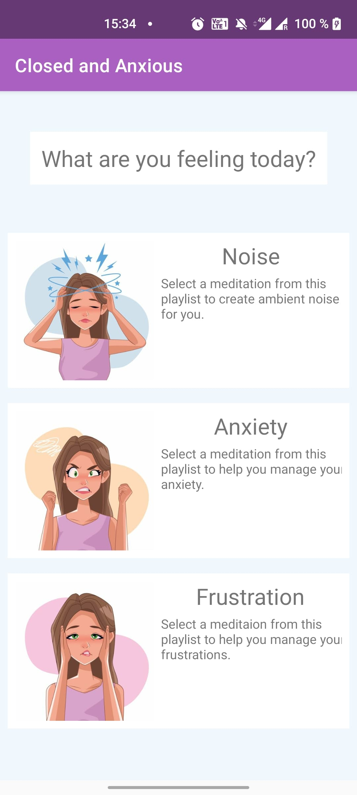
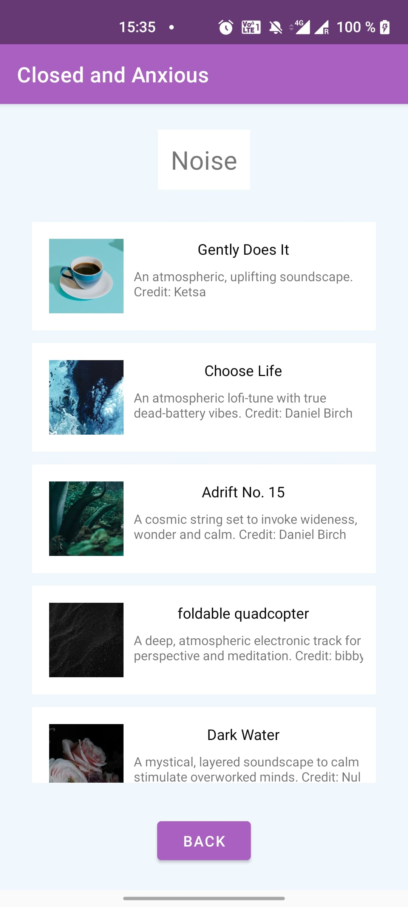
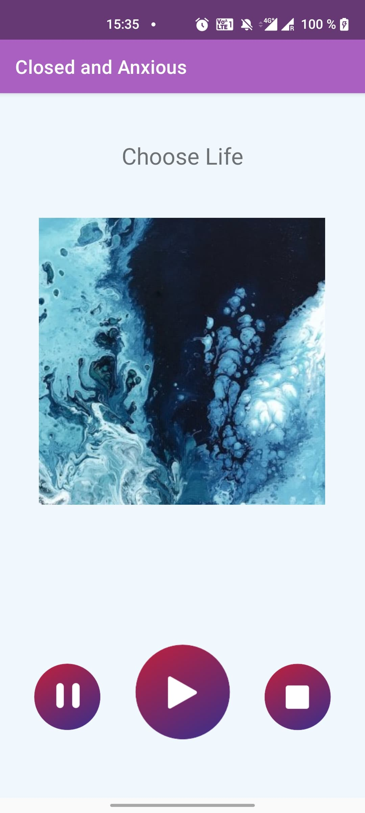

# Closed and Anxious
Closed and Anxious is a Software Design student meditation app, loosely based on the Danish app “Åben og rolig“.
We want to provide an application that has the ability to filter, display and play short audio files with guided robot voice meditations and soundscapes.
- The list displays are based on the RecyclerView
- Audio file information is persistently stored in an internal SQLite database on the device (including references to images and sound-files, not the files themselves)
- A ViewModel is used to allow Fragments access to this stored information
- The player is losely based on the stopwatch app example. Since the MediaPlayer utility manages its own lifecycles and concurrencies, we did not have to manually implement this.
- The user interface is designed via Constraint Layout
- Navigation is implemented using a Navigation graph and SafeArgs for argument passing between Destinations.

## Technical concepts included

### MutableLiveData
MutableLiveData is an "observable data holder class" (https://developer.android.com/topic/libraries/architecture/livedata) that makes changes in the held data objects observable by other classes - and is lifecycle-aware within the Activity that hosts it. By encapsulating a MutableLiveData object in a ViewModel-class, a single instance of the object can be shared between multiple fragments that are managed within a shared activity.
This allows for live-updates to UI-elements relying on data from the ViewModel. For example: when one Fragment updates the shared object, another Fragment observing the same ViewModel will be notified of the change and can update its UI-elements as needed.

In "Closed and Anxious", the CatView-class is the ViewModel that manages the Fragments' access to data. The contained MutableLiveData of type ArrayList<Playlist> is an in-app representation of the data contained in the database file created by the TracksDB (see SQLite database). While the TracksDB stores Strings and integers, the CatView calls this data from the persistent database-file and stores it as Track- and Playlist-objects the Fragments rely on. It ensures that all Fragments have access to the most up-to-date version of these objects.

Originally, we planned to manage the Mediaplayer through MutableLiveData, but found that the MediaPlayer-class provided by Android manages its own lifecycles in a way that makes more sense for our project (most importantly its destruction and release).
  
We pivoted to using the MutableLiveData for our data track, but our user interface and layout ultimately did not require the use of the observable nature of class. One way to 'force' this use could have been as a way of UI-'error'-handling for long load-times from the database.
 
If one category had a particularly large set of Tracks, and the call to populate the playlist would take several seconds, we could have encapsulated this in its own stream, displayed a loading message in the UI so long as the Playlist was unpopulated, and upon update, programmatically rendered the RecyclerView.

### ConstraintLayout
ConstraintLayout is one of the layout types provided by Android, making it possible to structure the user interface of a given activity and/or fragment. The advantage of this ViewGroup object is that it makes the user interface responsive.

We have exclusively used the ConstraintLayout for structuring the user interface of each Fragment in our application.
  
| 
Category UI
  | 
Playlist UI
 | 
Track UI
 | 
| ------------- | ------------- | ------------- |
|   |   |   |

The Category UI and the Playlist UI are available in landscape layout. The Track UI is NOT available in landscape layout, since the lifecycle actions resulting from turning the screen destroys the mediaplayer instance - as per its own lifecycle management. After reviewing other audio-play applications (including the original Åben og rolig app, Spotify and YouTube Music), we found that none of these apps support landscape layout for screens with audio playback.
  
### SQLite database
SQLite is a library that implements a small SQL relational database engine. It is used to store data on a users device as a .db-file in its local storage, it provides database operations. This enables the android device to store, retrieve and manipulate persistent data from this database file.

To create and use the SQLite database in our application, we use three classes TrackHelper, TrackCursorWrapper and TableSchema, as well as the 'main'-database class, TracksDB.

TrackBaseHelper is a subclass of SQLiteOpenHelper, which is a helper class used for creating the database.
TrackCursorWrapper is a subclass of CursorWrapper and is used to wrap and modify the Cursor-objects returned from a database call. Its purpose is to "get and translate" the information of a Track object into such objects in accordance with the schema of the database, defined in the TableSchema-class.
  The database consists of one table with five columns, mapped to Track-objects as defined in the TrackCursorWrapper.
  
The very first time the application is used, an instance of the database is created in the MainActivity class onCreate method, which setup the database and populates it with the associated information of the Track objects needed by the PlaylistUI and TrackUI classes.
 
In subsequent uses, the database is read as managed by the CatView class to create the Track and Playlist objects required.

### Navigation
The application consist of one MainActivity three Fragments (UIRWCategories, PlaylistUI and TrackUI), which are embedded in the body of main-activity by using a FragmentContainerView element as the NavhostFragment. This handles the navigation actions between the Destinations - here synonymous with our Fragments.

Since we are passing Arguments between Destinations, we are following Android's best practices use of the SafeArgs library. This enables safe arugment passing and navigation between the destinations. (See also here: https://developer.android.com/guide/navigation/navigation-pass-data).

Using the Destination and Action classes provided, we use onClick-methods associated with the RecyclerView PlaylistHolder and TrackHolder to define the Arguments to pass and navigate between to the next Fragments.
  

